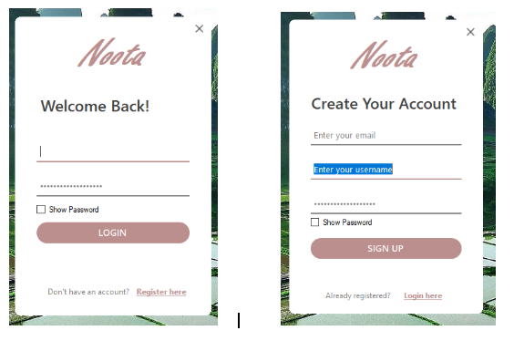
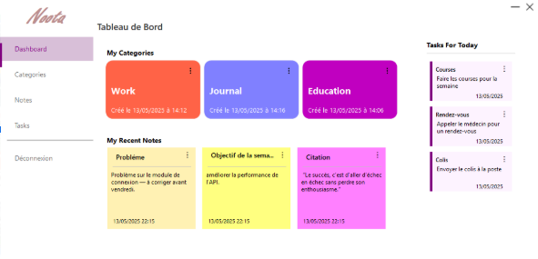
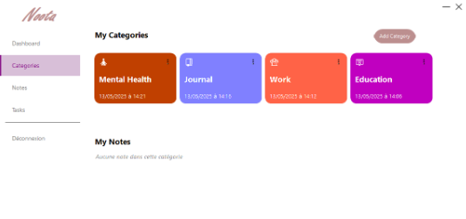
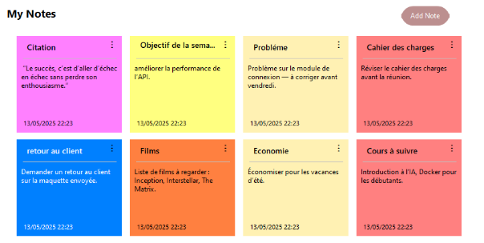
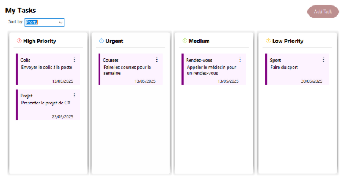

# Noota — Note and Task Manager

## Project Description

**Noota** is a note and task management application developed in **C#** with **Windows Forms (.NET Framework)**.  
It allows users to easily organize their ideas, tasks, and important reminders in a clear and intuitive interface.

---

## Main Features

### Authentication
- Users can create an account (**Sign up**) and log in (**Sign in**).

  

---

### Home
- Displays the **categories with the most notes**.  
- Shows the **three most recent notes**.  
- Lists **tasks scheduled for today**.

  

---

### Categories
- Each category has a **name**, **icon**, and **color**.  
- Users can create and delete categories.  
- Notes are organized by **category/theme**.

  

---

### Notes
- Each note has a **title** and **description**.  
- Text formatting options:
  - **Bold**, *Italic*, Underline
  - **Bullet lists**
- Customization:
  - Change the **note color**
  - **Import an image**
- Full management:
  - Create, edit, and delete notes
  - Display all notes

  

---

### Tasks
- Each task has a **title**, **description**, **due date**, **status**, and **priority**.  
- Available statuses: To Do, In Progress, Done, Delayed  
- Priority levels: Low, Medium, High, Urgent

  

